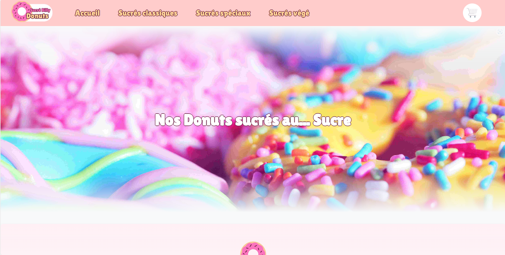

# 🍩 Sucré Billy Donuts - Site fictif

Bienvenue sur Sucré Billy Donuts, un site fictif développé dans le cadre d'un projet universitaire en première année d'études.

Ce site vitrine propose une sélection gourmande de donuts sucrés. Il permet de :
- Consulter la liste des donuts sous forme de vignettes/listes
- Filtrer les donuts selon plusieurs critères
- Consulter la fiche produit d'un donut
- Ajouter des commentaires sous chaque fiche produit
- Consulter ses articles dans un panier

---

## Languages et outils utilisés

Projet réalisé seule, en utilisant :

- **HTML / CSS** pour le front-end
- **Twig** pour le templating
- **PHP** pour la logique serveur
- **MySQL** avec **phpMyAdmin** pour la base de données

## Vidéo de démonstration

 Découvrez le site en vidéo :

[Sucré Billy Donuts - Vidéo Démo](https://youtu.be/tqCN1DR-f3Q)
